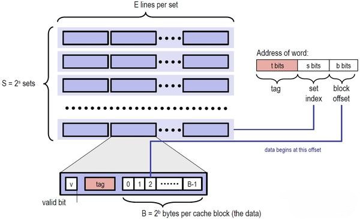

# CacheLab

```
 ________  ________  ________  ___  ___  _______   ___       ________  ________ 
|\   ____\|\   __  \|\   ____\|\  \|\  \|\  ___ \ |\  \     |\   __  \|\   __  \
\ \  \___|\ \  \|\  \ \  \___|\ \  \\\  \ \   __/|\ \  \    \ \  \|\  \ \  \|\  \
 \ \  \    \ \   __  \ \  \    \ \   __  \ \  \_|/_\ \  \    \ \   __  \ \   __  \
  \ \  \____\ \  \ \  \ \  \____\ \  \ \  \ \  \_|\ \ \  \____\ \  \ \  \ \  \|\  \
   \ \_______\ \__\ \__\ \_______\ \__\ \__\ \_______\ \_______\ \__\ \__\ \_______\
    \|_______|\|__|\|__|\|_______|\|__|\|__|\|_______|\|_______|\|__|\|__|\|_______|
```

中国人民大学（RUC） CacheLab（改编自 CMU CacheLab）

模板与问题反馈仓库：[CacheLab](https://github.com/RUCICS/Cachelab-2025Fall)

## ❗如何提问

遵守以下规范，以便得到助教及时的帮助（建议通过 issue 提问）：

- 请确保你已经阅读了 [everything-you-should-know](https://github.com/RUCICS/everything-you-should-know)，比如其中的 [How To Ask](https://github.com/RUCICS/everything-you-should-know/blob/main/ask/README.md)。
- 本实验相关的问题请提交到**模板仓库**的 [ISSUE](https://github.com/RUCICS/Cachelab-2025Fall/issues) 中，请在提交问题时检查其他 issue 是否有一样的问题，并反馈到已有的 issue 下，注意 GitHub 默认不显示已经 close 的问题，请注意修改 Filters 查找所有 issue。如果确有必要，助教会在 issue 中请求你加助教的微信解决，但即使你的问题需要加微信解决，**也烦请先用 issue 和助教取得联系，以确保其他人可以确认/解决相同的问题**。
- 除了本文档，你还需要在完成第二部分实验前仔细阅读 [`demo.cpp`](./demo.cpp)，这是第二部分的文档。依照经验，会有 50% 以上的问题是不读文档导致的，提出报告中解答了的问题可能会给助教留下不太好的印象。

> 模板仓库即 [https://github.com/RUCICS/Cachelab-2025Fall](https://github.com/RUCICS/Cachelab-2025Fall)，不要反馈到自己的作业仓库里了，我们收不到提醒。
>
> 为什么问题尽量公开问：
>
> 1. 问题往往是重复的，而且大家写 Lab 基本都是最后几天内，微信回不过来，问题和回答公开对于学生和助教来说都更快捷一点。
> 2. 偶尔会收到类似“某处的题怎么写”的问题，这类问题一般会以“看不懂文档要我干嘛”的形式出现，背后的含义一部分是助教认为文档再写就把答案写出来了，留下的地方需要学生思考；但也可能出现提示的效果确实低于预期，需要给出更多提示的修正情况，此时如果助教确实回答了，那这个回答应该公开，以示公平。
> 3. 其他不可以公开的问题：这类问题往往是因为问题本身包含了你个人的解法或者是个人信息，你可以试着在 ISSUE 中仅包含问题的描述，助教在和你加上微信解决问题后会再回到这个 ISSUE 中公开解决方案，并隐去中间调试过程不便公开的信息，目的同 1。
> 4. 培养在计算机领域提问的能力，[How To Ask](https://github.com/RUCICS/everything-you-should-know/blob/main/ask/README.md) 是课程设计的一部分，通过微信交流往往使人的提问和回答都比较随意和简陋，不便于培养提问的能力和未来解决问题的能力（比如在互联网上提问，问得不好没人回答），解决方案是用邮箱/ISSUE这种即时性差一点，但也更符合互联网情况的交流方式。
> 5. 公开问题事实上对助教提出了更高的要求，因为布置 Lab 时出现的差错都会公开，可以反向倒逼助教在一开始做足更好的准备，比如写好更全面的文档。

## ⚠️警告

因为本实验成绩参考排行榜，预计在 DDL 前访问流量会特别大，可预见地系统可能出现崩溃或响应极慢的问题，请合理安排完成作业的时间，以免影响你的成绩。**由于这个问题一旦出现，几乎无法解决，我们提供的保底方案是在 DDL 前上传到 Github 上**。

同时请用合理的频率上传你的作业，无论你是有意的，还是无意的，过高的访问频率可能会被服务器封禁。

## 项目编译与环境指南

本实验对系统的要求如下：

| System | Support |
| ------ | ------- |
| Ubuntu 20.04 LTS | ✔️ |
| Ubuntu 22.04 LTS | ✔️ |
| Ubuntu 24.04 LTS | ✔️ |

典型场景是用 WSL2 进行开发，如果你不具有这个环境，比如你是 Mac 用户，我们将给大家获取服务器登陆信息，在服务器上完成本实验（无法访问的时候请先考虑是否在校外且未开启校园网 VPN）。

> 助教不负责解决其他操作系统遇到的问题，甚至应该说强烈反对，即使下文中助教可能提供了为其他操作系统准备的内容，你也应该抱着这些内容是错的假设来使用，因为这些内容不会得到维护，当且仅当你认为自己有能力处理不同系统上的问题时才可以选择在自己喜欢的系统上做本实验，此时你可以以 Github Action 的结果来作为最终的参考。
>

### 如何编译

```bash
make -j
```

其中，所有 C 文件以 `gcc` 用 `c23` 标准编译，C++ 项目用 `g++` 以 `c++23` 标准编译，报告内不再赘述，请勿修改 `Makefile`，以免测试环境编译失败。

## 问题简述

本实验共有两个部分。在第一部分 Part A 中，你需要实现一个 cache simulator，用来统计内存缓存的命中次数等（不涉及寄存器开销）。第二部分，你需要实现一个矩阵乘法算子，并最优化其缓存和寄存器性能（寄存器的开销会由我们的判分程序替你统计）。

## 问题描述

### Part A：缓存模拟器

我们提供了生成内存访问记录的框架，

比如运行朴素实现的 $2 \times 2 \times 2$ 矩阵乘法：

```
./printTrace case0
```

它会输出 trace 文件，形如：

```
 L 0x30000000,4 8
 L 0x30000010,4 9
...
 L 0x3000001c,4 9
 S 0x3000002c,4 6
```

其中：
- L 和 S 分别代表 load 和 store。
- 后面的数字代表地址（16进制），如 0x3000000b，但是，请兼容 3000000b 这样的输入。注意对于 64 位平台的 `scanf` 来说，使用 `%lx` 读入即可同时正常读入这两种数据。注意地址空间是 64 位的。
- 逗号后的数字代表访问的内存大小（byte记），如 1，2，4，8，我们保证大小小于等于 8。
- 最后一个数字代表的是与这行操作相关的寄存器，这个数字为 -1 时代表立即数，比如 `C[0] = 0`。这个信息其实不影响你 Part A 的实现。

这一部分你需要做的是补全 `csim.c` 文件，使其能够正确地模拟一个具有 LRU 替换策略，Write-Back + Write-allocate 的 cache 的行为，计算 cache 的命中次数（hits）、缺失次数（misses）、替换次数（evictions）。

其中 evictions 是指当前 cache miss，且当前的 cache 已满，我们需要做一次 LRU 策略的替换，如果此时 cache 未满，只要存入 cache 即可，就不会导致 evictions 增加。

更具体地来说，程序结束后你需要调用我们提供的 `printSummary` 函数输出这三个值。作为参考，我们提供了 `csim-ref` 程序，在你正确完成本任务后，你的结果应该和它完全一致。cache 的硬件配置通过命令行参数给出，关于怎么在 C 语言中处理命令行参数，你可以询问 AI。

命令行参数规定如下：

```
Usage: ./csim [-hv] -s <num> -E <num> -b <num> -t <file>
Options:
  -h         Print this help message.
  -v         Optional verbose flag.
  -s <num>   Number of set index bits.
  -E <num>   Number of lines per set.
  -b <num>   Number of block offset bits.
  -t <file>  Trace file.

Examples:
  linux>  ./csim -s 4 -E 1 -b 4 -t traces/yi.trace
  linux>  ./csim -v -s 8 -E 2 -b 4 -t traces/yi.trace
```

完成后，我们会将你的 csim 和提供的 csim-ref 的运行结果进行比对，测试文件在 `traces` 文件夹下，你需要保证输出一致。



#### 实现要求

- 用 `C` 或 `C++` 实现，默认是 `gcc`，所以请用 `C` 语法。如果你想用 `C++`，请将文件名改为 `csim.cpp`，并强制编译一次，比如 `make -B csim` 以使得改动立即生效，之后可以正常 `make`
- 你需要以支持任意合理的 s，E，b 参数为目标设计你的代码，并至少支持 traces 文件夹下的各种样例
- 你需要保证你的代码没有任何编译警告

#### 测试与分数

我们假设你的系统中安装有 python3（通常如此），那么你只需要

```bash
python3 test/csim_test.py
# 提示：请不要 cd 到 test 目录下执行
# 或者 push 到 Github Classroom 里，由 autograding 来测试 
```

得到这样的输出代表你的实现是正确的：

```bash
status | trace_file         | (s, E, b) | ref: (hits, misses, evictions) | handin: (hits, misses, evictions)
-------+--------------------+-----------+--------------------------------+----------------------------------
OK     | traces/yi2.trace   | (5, 1, 5) | (15, 1, 0)                     | (15, 1, 0)                       
OK     | traces/yi.trace    | (5, 1, 5) | (3, 4, 0)                      | (3, 4, 0)                        
OK     | traces/dave.trace  | (5, 1, 5) | (2, 3, 0)                      | (2, 3, 0)                        
OK     | traces/trans.trace | (5, 1, 5) | (211, 7, 0)                    | (211, 7, 0)                      
OK     | traces/long.trace  | (5, 1, 5) | (246213, 21775, 21743)         | (246213, 21775, 21743)           
OK     | traces/yi2.trace   | (2, 4, 3) | (14, 2, 0)                     | (14, 2, 0)                       
OK     | traces/yi.trace    | (2, 4, 3) | (2, 5, 0)                      | (2, 5, 0)                        
OK     | traces/dave.trace  | (2, 4, 3) | (0, 5, 0)                      | (0, 5, 0)                        
OK     | traces/trans.trace | (2, 4, 3) | (192, 26, 10)                  | (192, 26, 10)                    
OK     | traces/long.trace  | (2, 4, 3) | (243398, 24590, 24574)         | (243398, 24590, 24574)           
OK     | traces/yi2.trace   | (4, 2, 4) | (15, 1, 0)                     | (15, 1, 0)                       
OK     | traces/yi.trace    | (4, 2, 4) | (2, 5, 2)                      | (2, 5, 2)                        
OK     | traces/dave.trace  | (4, 2, 4) | (2, 3, 0)                      | (2, 3, 0)                        
OK     | traces/trans.trace | (4, 2, 4) | (206, 12, 0)                   | (206, 12, 0)                     
OK     | traces/long.trace  | (4, 2, 4) | (247163, 20825, 20793)         | (247163, 20825, 20793)           
OK     | traces/yi2.trace   | (1, 1, 1) | (8, 8, 6)                      | (8, 8, 6)                        
OK     | traces/yi.trace    | (1, 1, 1) | (0, 7, 5)                      | (0, 7, 5)                        
OK     | traces/dave.trace  | (1, 1, 1) | (0, 5, 4)                      | (0, 5, 4)                        
OK     | traces/trans.trace | (1, 1, 1) | (25, 193, 192)                 | (25, 193, 192)                   
OK     | traces/long.trace  | (1, 1, 1) | (35393, 232595, 232594)        | (35393, 232595, 232594)          

Score: 100.00
```

我们的分数为 $100 \times 正确比例$