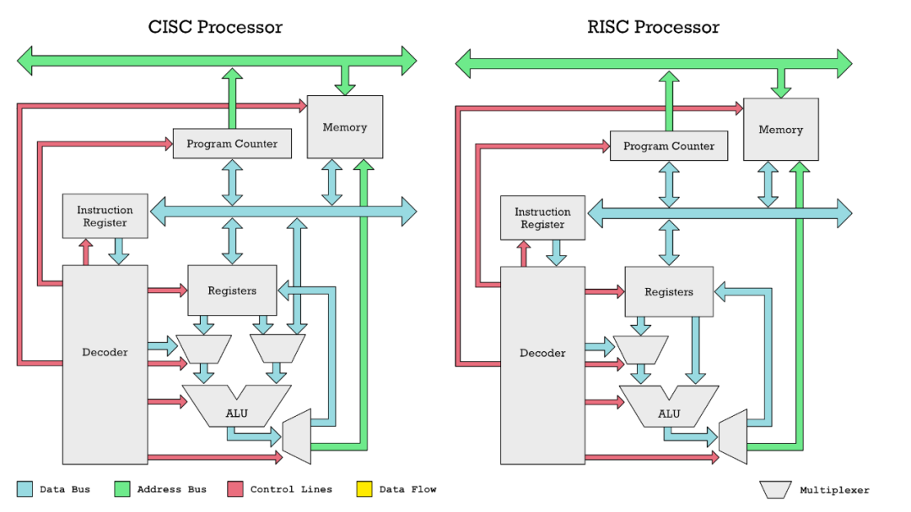

# CacheLab

```
 ________  ________  ________  ___  ___  _______   ___       ________  ________ 
|\   ____\|\   __  \|\   ____\|\  \|\  \|\  ___ \ |\  \     |\   __  \|\   __  \
\ \  \___|\ \  \|\  \ \  \___|\ \  \\\  \ \   __/|\ \  \    \ \  \|\  \ \  \|\  \
 \ \  \    \ \   __  \ \  \    \ \   __  \ \  \_|/_\ \  \    \ \   __  \ \   __  \
  \ \  \____\ \  \ \  \ \  \____\ \  \ \  \ \  \_|\ \ \  \____\ \  \ \  \ \  \|\  \
   \ \_______\ \__\ \__\ \_______\ \__\ \__\ \_______\ \_______\ \__\ \__\ \_______\
    \|_______|\|__|\|__|\|_______|\|__|\|__|\|_______|\|_______|\|__|\|__|\|_______|
```

中国人民大学（RUC） CacheLab（改编自 CMU CacheLab）原作者：[panjd123 (Jarden Pan)](https://github.com/panjd123)，RUC

模板与问题反馈仓库：[CacheLab](https://github.com/RUCICS/Cachelab-2025Fall)

## ❗ 如何提问

遵守以下规范，以便得到助教及时的帮助：

- 请确保你已经阅读了 [everything-you-should-know](https://github.com/RUCICS/everything-you-should-know)，比如其中的 [How To Ask](https://github.com/RUCICS/everything-you-should-know/blob/main/ask/README.md)。
- 对于本实验相关的问题，你可以提交到以下几个地方
  - 把问题提交到**模板仓库**的 [ISSUE](https://github.com/RUCICS/Cachelab-2025Fall/issues) 中
    - 请在提交问题时检查其他 issue 是否有一样的问题，如果有请将其反馈到对应的 issue 下
    - 注意：GitHub 默认不显示已经 close 的问题，请注意修改 Filters 查找所有 issue

  - 把问题提交到 **ICS 答疑论坛**的 [Cache Lab](http://forum.rucics.tech/) 中
    - 同样的，请检查你的问题是不是已经被别人提出并被解决过了，你可以在答疑论坛的对应帖子下进行反馈
    - 注意，要访问答疑论坛，请保证你处在**校园网环境**中，且不要通过微信自带的浏览器（也就是直接点击链接跳转的）进入该论坛

  - 如果**确有必要**或者你**实在不敢在公共空间发言**（虽然答疑论坛可以匿名），你也可以添加助教微信解决问题
    - 虽然这样并不影响评分，但是还是烦请你先用前面两种问题反馈渠道，以确保其他人可以确认/解决相同的问题。
    - 本 Lab 的主要负责助教为张昕跃和方言诚两位同学，他们会更加清楚Lab的内容，当然你也可以自由地寻求帮助

- 除了本文档，你还需要在完成第二部分实验前仔细阅读 [`demo.cpp`](./demo.cpp)，这是第二部分的文档。依照经验，会有 50% 以上的问题是不读文档导致的，提出文档中已明确说明了的问题可能会给助教留下不太好的印象。

> 模板仓库即 [https://github.com/RUCICS/Cachelab-2025Fall](https://github.com/RUCICS/Cachelab-2025Fall)，请注意不要反馈到自己的作业仓库里了，那是个人的repository，助教们收不到提醒。
>
> 为什么问题尽量公开问：
>
> 1. 问题往往是重复的，且根据经验大家写 Lab 基本都是最后几天内，微信回不过来，问题和回答公开对于学生和助教来说都更快捷一点。
> 2. 偶尔会收到类似“某处的题怎么写”的问题，这类问题一般会以“看不懂文档要我干嘛”的形式出现，背后的含义一部分是助教认为文档再写就把答案写出来了，留下的地方需要学生思考；但也可能出现提示的效果确实低于预期，需要给出更多提示的修正情况，此时如果助教确实回答了，那这个回答应该公开，以示公平。
> 3. 其他不可以公开的问题：这类问题往往是因为问题本身包含了你个人的解法或者是个人信息，你可以试着在 ISSUE 中仅包含问题的描述，助教在和你加上微信解决问题后会再回到这个 ISSUE 中公开解决方案，并隐去中间调试过程不便公开的信息，目的同 1。
> 4. 培养在计算机领域提问的能力，[How To Ask](https://github.com/RUCICS/everything-you-should-know/blob/main/ask/README.md) 是课程设计的一部分，通过微信交流往往使人的提问和回答都比较随意和简陋，不便于培养提问的能力和未来解决问题的能力（比如在互联网上提问，问得不好没人回答），解决方案是用邮箱/ISSUE这种即时性差一点，但也更符合互联网情况的交流方式。
> 5. 公开问题事实上对助教提出了更高的要求，因为布置 Lab 时出现的差错都会公开，可以反向倒逼助教在一开始做足更好的准备，比如写好更全面的文档。
> 6. 两种公开渠道各有其优势：Github 中的反馈会即时发送到助教邮箱，且在 ISSUE 里提问也是使用 Github 等平台所应该具备的基础技能；对于 ICS 答疑论坛，它提供了匿名的提问渠道，（可能）可以提高部分同学的提问积极性，所以从助教层面来看这种多渠道提问并不会显得冗余

## ⚠️ 实验须知

在正式开始写本 Lab 前，请务必知晓以下实验须知：

- 由于本实验成绩会参考排行榜，预计在 DDL 前访问流量会特别大，可预见地系统可能出现崩溃或响应极慢的问题，**请合理安排完成作业的时间**，以免影响你的成绩。**由于这个问题一旦出现，几乎无法解决，我们提供的保底方案是在 DDL 前上传到 Github 上**。

- 请用合理的频率上传你的作业。无论你是有意的，还是无意的，过高的访问频率可能会被服务器封禁。

## 项目编译与环境指南

本实验对系统的要求如下：

| System | Support |
| ------ | ------- |
| Ubuntu 24.04 LTS | ✔️ |

> 请你最好使用Ubuntu 24.04，因为地址随机化的bug导致22.04会出现问题，但我们在Makefile中关闭了地址检查，所以理论上22.04也可以跑。

> **注意：这并不意味着你可以忽视越界访问，野指针等和地址相关的编程错误**

典型场景是用 WSL2 进行开发，如果你不具有这个环境，比如你是 Mac 用户，我们将给大家获取服务器登陆信息，在服务器上完成本实验（无法访问的时候请先考虑是否在校外且未开启校园网 VPN）。

> 助教不负责解决其他操作系统遇到的问题，甚至应该说强烈反对，即使下文中助教可能提供了为其他操作系统准备的内容，你也应该抱着这些内容是错的假设来使用，因为这些内容不会得到维护，当且仅当你认为自己有能力处理不同系统上的问题时才可以选择在自己喜欢的系统上做本实验，此时你可以以 Github Action 的结果来作为最终的参考。

### 如何编译

```bash
make -j
```

其中，所有 C 文件以 `gcc` 用 `c23` 标准编译，C++ 项目用 `g++` 以 `c++23` 标准编译，报告内不再赘述，请勿修改 `Makefile`，以免测试环境编译失败。

## 问题简述

本实验共有两个部分。在第一部分 Part A 中，你需要在 `csim.c` 中实现一个 cache simulator，用来统计内存缓存的命中次数等（不涉及寄存器开销）。第二部分，你需要在 `gemm.cpp` 中实现矩阵乘法算子，并最优化其缓存和寄存器性能（对于寄存器的开销会由我们的判分程序替你统计）。

## Part A：缓存模拟器

我们提供了生成内存访问记录的框架，

比如运行朴素实现的 $2 \times 2 \times 2$ 矩阵乘法：

```
./printTrace case0
```

它会输出 trace 文件，形如：

```
 L 0x30000000,4 8
 L 0x30000010,4 9
...
 L 0x3000001c,4 9
 S 0x3000002c,4 6
```

其中：
- L 和 S 分别代表 load 和 store。
- 后面的数字代表地址（16进制），如 0x3000000b，但是，请兼容 3000000b 这样的输入。注意对于 64 位平台的 `scanf` 来说，使用 `%lx` 读入即可同时正常读入这两种数据。注意地址空间是 64 位的。
- 逗号后的数字代表访问的内存大小（byte记），如 1，2，4，8，我们保证大小小于等于 8。
- 最后一个数字代表的是与这行操作相关的寄存器，这个数字为 -1 时代表立即数，比如 `C[0] = 0`。这个信息其实不影响你 Part A 的实现。

**这一部分你需要做的是补全 `csim.c` 文件**，使其能够正确地模拟一个具有 LRU 替换策略，Write-Back + Write-allocate 的 cache 的行为，计算 cache 的命中次数（hits）、缺失次数（misses）、替换次数（evictions）。

其中 evictions 是指当前 cache miss，且当前的 cache 已满，我们需要做一次 LRU 策略的替换，如果此时 cache 未满，只要存入 cache 即可，就不会导致 evictions 增加。

更具体地来说，程序结束后你需要调用我们提供的 `printSummary` 函数输出这三个值。作为参考，我们提供了 `csim-ref` 程序，在你正确完成本任务后，你的结果应该和它完全一致。cache 的硬件配置通过命令行参数给出，关于怎么在 C 语言中处理命令行参数，你可以询问 AI。

命令行参数规定如下：

```txt
Usage: ./csim [-hv] -s <num> -E <num> -b <num> -t <file>
Options:
  -h         Print this help message.
  -v         Optional verbose flag.
  -s <num>   Number of set index bits.
  -E <num>   Number of lines per set.
  -b <num>   Number of block offset bits.
  -t <file>  Trace file.
```

你可以通过类似的 terminal 语句来给对应的测试点进行测试

```txt
Examples:
  linux>  ./csim -s 4 -E 1 -b 4 -t traces/yi.trace
  linux>  ./csim -v -s 8 -E 2 -b 4 -t traces/yi.trace
```

完成后，我们会将你的 csim 和提供的 csim-ref 的运行结果进行比对，测试文件在 `traces` 文件夹下，你需要保证输出一致。

### 实现要求

- 用 `C` 或 `C++` 实现，默认是 `gcc`，所以请用 `C` 语法。如果你想用 `C++`，请将文件名改为 `csim.cpp`，并强制编译一次，比如 `make -B csim` 以使得改动立即生效，之后可以正常 `make`
- 你需要以支持任意合理的 s，E，b 参数为目标设计你的代码，并至少支持 traces 文件夹下的各种样例
- 你需要保证你的代码没有任何编译警告

### 测试与分数

我们假设你的系统中安装有 python3（通常如此），那么你只需要

```bash
python3 test/csim_test.py
# 提示：请不要 cd 到 test 目录下执行
# 或者 push 到 Github Classroom 里，由 autograding 来测试 
```

得到这样的输出代表你的实现是正确的：

```bash
status | trace_file         | (s, E, b) | ref: (hits, misses, evictions) | handin: (hits, misses, evictions)
-------+--------------------+-----------+--------------------------------+----------------------------------
OK     | traces/yi2.trace   | (5, 1, 5) | (15, 1, 0)                     | (15, 1, 0)                       
OK     | traces/yi.trace    | (5, 1, 5) | (3, 4, 0)                      | (3, 4, 0)                        
OK     | traces/dave.trace  | (5, 1, 5) | (2, 3, 0)                      | (2, 3, 0)                        
OK     | traces/trans.trace | (5, 1, 5) | (211, 7, 0)                    | (211, 7, 0)                      
OK     | traces/long.trace  | (5, 1, 5) | (246213, 21775, 21743)         | (246213, 21775, 21743)           
OK     | traces/yi2.trace   | (2, 4, 3) | (14, 2, 0)                     | (14, 2, 0)                       
OK     | traces/yi.trace    | (2, 4, 3) | (2, 5, 0)                      | (2, 5, 0)                        
OK     | traces/dave.trace  | (2, 4, 3) | (0, 5, 0)                      | (0, 5, 0)                        
OK     | traces/trans.trace | (2, 4, 3) | (192, 26, 10)                  | (192, 26, 10)                    
OK     | traces/long.trace  | (2, 4, 3) | (243398, 24590, 24574)         | (243398, 24590, 24574)           
OK     | traces/yi2.trace   | (4, 2, 4) | (15, 1, 0)                     | (15, 1, 0)                       
OK     | traces/yi.trace    | (4, 2, 4) | (2, 5, 2)                      | (2, 5, 2)                        
OK     | traces/dave.trace  | (4, 2, 4) | (2, 3, 0)                      | (2, 3, 0)                        
OK     | traces/trans.trace | (4, 2, 4) | (206, 12, 0)                   | (206, 12, 0)                     
OK     | traces/long.trace  | (4, 2, 4) | (247163, 20825, 20793)         | (247163, 20825, 20793)           
OK     | traces/yi2.trace   | (1, 1, 1) | (8, 8, 6)                      | (8, 8, 6)                        
OK     | traces/yi.trace    | (1, 1, 1) | (0, 7, 5)                      | (0, 7, 5)                        
OK     | traces/dave.trace  | (1, 1, 1) | (0, 5, 4)                      | (0, 5, 4)                        
OK     | traces/trans.trace | (1, 1, 1) | (25, 193, 192)                 | (25, 193, 192)                   
OK     | traces/long.trace  | (1, 1, 1) | (35393, 232595, 232594)        | (35393, 232595, 232594)          

Score: 100.00
```

我们的分数为 $100 \times 正确比例$

## Part B：矩阵乘法优化

### 故事背景

本次题目基于 RISC-V 架构的 CPU，以下是一些背景知识。

当今处理器有三大主流架构：X86，ARM 和 RISC-V，由于使用 X86 或者 ARM 架构时都需要获取授权，并缴纳最高上百万美元的授权费，且投产后每枚芯片都需要单独再收取费用，所以 RISC-V 架构逐渐成为了学术界和开源界的首选，中国是 RISC-V 架构的重要贡献者之一。

我们比较熟悉的 X86 架构是 CISC（Complex Instruction Set Computer）架构，而 ARM 和 RISC-V 是 RISC（Reduced Instruction Set Computer）架构。这两种架构的区别在于指令集的复杂度，CISC 架构的指令集更加复杂，一个指令可以完成多个操作，而 RISC 架构的指令集更加简单，一个指令只完成一个操作。这样的区别导致了 RISC 架构的 CPU 更加容易设计，同时功耗也更低，过去一般认为 CISC 架构的 CPU 性能更好，但随着技术的发展，这个结论也逐渐不绝对，比如 ARM 架构的 CPU 往往可以在相同功耗下堆叠更多的核心，从而可能获得更好的性能。

CISC 和 RISC 架构一个显著的具体区别是在 CISC（如 X86）中，操作数可以直接从内存送进算术逻辑单元（ALU）进行计算，而在 RISC（如 ARM 和 RISC-V）中，操作数必须先送入寄存器，然后再送入 ALU 进行计算。



实质上，在 CISC 架构中访问内存相比于直接访问寄存器也不是零成本的，这个开销被隐藏在 CPU 内部从而不方便我们观察与优化，但是在 RISC 架构中，这个开销是可以在汇编指令层面被观察到。

以这段代码为例：

```c
void test(int mem[]) {
    mem[2] += mem[0] * mem[1];
}
```

X86 (32-bits) 的[汇编代码](https://godbolt.org/z/MTEfM89jM)为：

```asm
_Z4testPi:
        movl    (%rdi), %eax
        imull   4(%rdi), %eax
        addl    %eax, 8(%rdi)
        ret
```

RISC-V (32-bits) 的[汇编代码](https://godbolt.org/z/s1boK5bE8)为：

```asm
_Z4testPi:
        lw      a4,0(a0)
        lw      a3,4(a0)
        lw      a5,8(a0)
        mul     a4,a4,a3
        add     a5,a5,a4
        sw      a5,8(a0)
        ret
```

可以发现 RISC-V 的汇编显式地将内存读取到寄存器，然后再进行计算。同时 32 位 RISC-V 是用寄存器传参的，类似 64 位 X86 的行为。

我们的题目就是基于类似 RISC-V 架构的 CPU。

具体来说，我们假设的 CPU 在工作时不能直接用内存中的数据计算，内存中的值会先加载到 cache 里，再从 cache 加载到寄存器 register 里，CPU 用寄存器完成计算后把计算结果从寄存器写回 cache，再写回内存。

为了提升这个过程的性能，我们有至少两种优化思路：

- 减少内存读写：即通过访问模式设计，减少 cache miss，尽量复用 cache
- 减少 cache 读写：即通过访问模式设计，减少去读写 cache，尽量复用寄存器

我们的题目只考虑以上内存访问过程中的性能，不考虑计算的性能，比如加法和乘法指令我们认为是零成本的。

### cache 性能优化

其中“减少内存读写”就是课上提到或将提到的内容，我们会在这里简要回顾一下，假如你在以列优先的方式访问一个二维数组 `B`：

```c
int B[256][256];
for (int j = 0; j < 256; j++) {
    for (int i = 0; i < 256; i++) {
        do_something(B[i][j]);
    }
}
```

直接实现，会导致 B 的内存访问不连续。假设 cache 的行大小是 32 字节，即 8 个 int，我们可以对访问进行分块，即每次处理一个 $8 \times 8$ 的子矩阵，这样每个子矩阵在访问的过程中都充分利用了已经读取的 cache 行，减少了 cache miss。

```c
for (int j = 0; j < 256; j += 8) {
    for (int i = 0; i < 256; i += 8) {
        for (int jj = j; jj < j + 8; jj++) {
            for (int ii = i; ii < i + 8; ii++) {
                do_something(B[ii][jj]);
            }
        }
    }
}
```

### 寄存器性能优化

本实验显式地加入了对寄存器性能的考量。我们以下一个迷你矩阵乘法为例，介绍寄存器性能的优化的含义。

考虑两个 $2 \times 2$ 矩阵相乘的场景，假设此时所有数据已经 cache 里，我们只关注寄存器层面的问题。

**Solution 1**

```c
for (int i = 0; i < 2; i++) {
    for (int j = 0; j < 2; j++) {
        for (int k = 0; k < 2; k++) {
            C[i][j] += A[i][k] * B[k][j];
        }
    }
}
```

这是一个典型的矩阵乘法代码，如果完全不加优化地直接执行，CPU 的执行过程类似这样：

``` c
load A[0][0] to reg1
load B[0][0] to reg2
    calculate reg3 = reg1 * reg2
load C[0][0] to reg4
    calculate reg4 = reg4 + reg3
store reg4 to C[0][0]
...
```

一共需要执行 8 次这样的操作，意味着 24 次 load 和 8 次 store。

**Solution 2**

为了优化，我们显式地声明寄存器来规定代码的行为。为了方便，我们假设 reg 就是一个寄存器类型。

```c
for (reg i = 0; i < 2; ++i) {
    for (reg j = 0; j < 2; ++j) {
        reg tmpc = 0;
        for (reg k = 0; k < 2; ++k) {
            reg tmpa = A[i][k];
            reg tmpb = B[k][j];
            tmpc += tmpa * tmpb;
        }
        C[i][j] = tmpc;
    }
}
```

此时经过优化后的执行过程类似这样：

```c
    calculate tmpc = 0
load A[0][0] to tmpa
load B[0][0] to tmpb
    calculate tmpa = tmpa * tmpb
    calculate tmpc = tmpc + tmpa
store tmpc to C[0][0]
...
```

这样的操作执行 8 遍，最后只需要执行 16 次 load 和 4 次 store，减少了大量的内存/cache访问，减少的部分是由于我们只读和写了 `C[i][j]` 一次，而不像上一个解法那样每次都重新立刻读写。

**Solution 3**

我们还可以优化，注意到数据实际上只有 8 个 int 要读入，我们却使用了 16 次 load，一个暴力的优化方法是，全部加载到寄存器，计算后再导出：

```c
reg tmpa[2][2];
reg tmpb[2][2];
reg tmpc[2][2];
for (reg i = 0; i < 2; ++i) {
    for (reg j = 0; j < 2; ++j) {
        tmpc[i][j] = 0;
        tmpa[i][j] = A[i][j];
        tmpb[i][j] = B[i][j];
    }
}
for (reg i = 0; i < 2; ++i) {
    for (reg j = 0; j < 2; ++j) {
        for (reg k = 0; k < 2; ++k) {
            tmpc[i][j] += tmpa[i][k] * tmpb[k][j];
        }
    }
}
for (reg i = 0; i < 2; ++i) {
    for (reg j = 0; j < 2; ++j) {
        C[i][j] = tmpc[i][j];
    }
}
```

这样我们达到了理论上的最优性能，只需要 8 次 load 和 4 次 store。代价是我们需要大量的寄存器，而 CPU 上的寄存器是有限的，我们会在问题描述中详细规定硬件配置。


### 框架说明

> [`demo.cpp`](./demo.cpp) 是本框架的详细文档，请在读完本文档后详细阅读并了解更多用法。

以上我们简要介绍了寄存器性能的含义以及 RISC-V 架构下你不能直接操作内存这个限制。

但是要控制寄存器的行为，通常需要在汇编代码层面操作，而我们并不想你们手搓汇编，所以，我们我们提供了一个框架，你只需要模仿在写汇编，我们会模拟统计寄存器和内存的访问/使用情况。

在这个框架下，你可以当作你在写一种特别的 `C/C++` 代码，但有两个特殊之处：

第一，只有两种类型，`ptr_reg` 和 `reg` 分别和 `int*` 和 `int` 对应，比如原来长这样的代码：

```c
void example(int* mem){
    int a = mem[0];
    mem[0] = a * 2;
}
```

现在对应的代码是这样的：

```c
void example_now(ptr_reg mem){
    reg a = mem[0];
    mem[0] = a * 2;
}
```

第二，内存不能直接操作，必须经过寄存器，比如原来长这样的代码：

```c
void example(int* mem){
    mem[0] = mem[0] * 2;
}
```

直接翻译过来会报错，你需要先存到寄存器里：

```c
void example_now(ptr_reg mem){
    // mem[0] = mem[0] * 2; // 这会报错
    reg a = mem[0];
    mem[0] = a * 2;
}
```

以上代码如果翻译成 RISC-V 汇编，大概是这样的，其中他会把乘2优化成左移一位，不过我们只考虑内存访问，即 `lw` 和 `sw` 相关的性能，所以这并不重要：

``` nasm
    lw      a5,0(a0)
    slli    a5,a5,1
    sw      a5,0(a0)
    ret
```

或者换句话来说，你正在写面向对象的代码，对象就是内存和寄存器。

在本实验中，`demo.cpp`文件仅用于为你介绍寄存器的使用方式，我们没有在Makefile中提供编译接口。

再次强调，**具体哪些操作是允许的请见 [`demo.cpp`](./demo.cpp)，本框架规定了可使用操作的上限**，但可能有未发现的应该禁止的行为，请各位在使用时遵从“内存和内存不能直接操作，必须经过寄存器的原则自行判断你是否绕过了框架限制。

### 题目描述

以上你应该已经理解了寄存器性能和 Cache 性能，以及我们提供的框架的含义，现在你需要基于我们提供的框架，**将这些优化实现进 [`gemm.cpp`](./gemm.cpp) 里**，目前 [`gemm.cpp`](./gemm.cpp) 只提供了最朴素的算法用作演示。

我们假设的硬件环境是：

- cache：LRU 替换策略，s = 5，E = 1，b = 4
- CPU：一共 36 个寄存器，我们的框架会在你使用超过 36 个寄存器时抛出运行时错误
- 读写一次内存需要 15 个单位时间
- 读写一次 cache 需要 1 个单位时间

你们需要优化的有 case1，case2，case3 三种情况，分别对应

- case1: $16 \times 16 \times 16$ 矩阵乘法
- case2: $32 \times 32 \times 32$ 矩阵乘法
- case3: $29 \times 35 \times 29$ 矩阵乘法

本题 $m \times n \times p$ 表示 $A, B, C$ 矩阵的形状分别为 $m \times n, n \times p, m \times p$，他们满足 $C = AB$

你可以运行 `./printTrace case1` 来查看你的算法执行 case1 的矩阵乘法时对应的 trace 文件。

运行 `make case1` 会帮你把这份 trace 文件保存到 `gemm_traces/case1.trace` 下，并调用 `csim-ref` 来计算对应的 cache 行为。

不难看出，其中 misses 就代表了你的算法读写内存的次数，记作 $miss_{cache}$。同时，trace 文件的行数就代表了你读写 cache 的次数，记作 $miss_{reg}$。

我们的实验要求你最优化内存和 cache 的访问时间，即最优化 $latency = 15 \times miss_{cache} + miss_{reg}$。

### 实现注意事项

请严格按照以下要求进行实验（**请专注于对 cache 本身的优化**）：

- 编译器为 `g++`，允许用 `g++` 编译器支持的 `C/C++` 语法。注意，因框架原因只能用 `g++` 编译
- 你需要保证你的代码没有任何编译警告
- 你只能修改 `gemm.cpp` 文件
- 不能使用除了 `ptr_reg` 和 `reg` 外的任何数据类型
- 不能申请任何内存，如果你需要内存来暂存东西，而不是寄存器，你可以使用 `buffer` 字段
- 禁止利用任何二进制技巧在一个寄存器/内存上，存储多个数值
- 禁止使用复杂度低于 $O(n^3)$ 的矩阵乘法算法，比如 Strassen 算法
- 严格按照框架的假设来设计代码，不允许绕过框架或者改变框架，即不允许利用漏洞，注意，这意味着请再次仔细阅读 [`demo.cpp`](./demo.cpp)，彻底理解这个框架
- 你的代码需要通过我们提供的在线测试（比如排行榜），而不是仅仅本地环境能通过
- 尽量使用合适格式化规则来格式化你的代码

### 测试与分数

**⭐准备工作：**如果你首次运行 `python3 test/gemm_test.py` ，terminal 中会提示要求你输入对应的排行榜密钥，请在 [`obe`](https://unicourse.ruc.edu.cn/) 中找到对应ICS课程作业中的 ”**获取排行榜密钥**“ 这一项，并且提交该作业，助教将会把你的**个人密钥**通过 **"评语"** 一栏发送给你（这会在首次布置 Cache Lab 的上机课上完成）

运行以下命令可以在本地获取详细的性能报告，同时自动上传 `gemm.cpp` 到排行榜上，自动上传有 30 秒的间隔，如果你想强制上传，请用上传脚本 `./submit_gemm.sh` 上传。

``` bash
python3 test/gemm_test.py
# 提示：请不要 cd 到 test 目录下执行
# 你需要保证你的 csim 是正确的，否则这一节的结果将没有意义

# 强制上传
./submit_gemm.sh
```

请注意排行榜上仅保留最优提交，请在提交报告时注意提交对应的版本（分数与排行榜一致即可），**不一致会被当作作弊严肃处理**。

性能报告会指出你实现的 gemm 算法的 $miss_{cache}$、 $miss_{reg}$ 和 $latency$，以及这个 $latency$ 和最初 baseline 实现的版本相比的加速比 $speedup$，最终这三份 $speedup$ 会以加权的形式得到一个**综合加速比**，其中不同 case 的加速比对应的加权权重为

| case  | 权重 |
| ----- | ---- |
| case0 | 0%   |
| case1 | 30%  |
| case2 | 30%  |
| case3 | 40%  |

> 为了让大家理解，我们也会在上机课上演示文档中提到的优化 case0 的寄存器性能以达到理论最优。因此尽管我们的排行榜上包括 case0 的加速比，但这不会包括在最终得分里。

对 Part B 的性能打分会参考这个综合加速比在实验结束后调整确定（这个打分是非常人性化且富有人道主义的，助教们会通过 $px^q$ 即类似 $10\sqrt{x}$ 或正态函数的转换函数，综合解决方法的 ”先进性" 对最后的成绩进行调整。总之，助教希望看到你对这个 lab 中问题的独到见解，对于解决方法的综合评判/打分，排行榜上的数据只是其中并不重大的一部分）

### 实验提示

我们给出一些实验提示。~~虽然并不需要完全用到，你也不一定完全理解~~

- 优化难度视你采用的方法，不一定是从 case1 到 case3 递增的。
- 分块是一个缓解 cache 冲突的好办法：[waside-blocking.pdf](https://csapp.cs.cmu.edu/public/waside/waside-blocking.pdf)，不过，我们有两级 cache，**仔细思考该如何分块**，只需要分一次吗。
- 可以考虑迭代次序的影响，即 `i、j、k` 或者别的次序，注意因为 cache 的规格不同，结论和课上（实际CPU）的情况可能不同。
- CMU cachelab 中优化的算法是矩阵转置，我们的是矩阵乘法，但是除了分块，可能还有其他相同的优化策略可以用。
- [寄存器性能优化](#寄存器性能优化) 章节中我们已经提示了寄存器的优化方法。
- 寄存器可能不够用，这时候你可以暂存到 buffer 字段里，你可以评估一下这是否值得。
- 注意到 A，B，C，buffer 的排列是紧密的，所以 buffer 的另外一个用途是调整矩阵的 offset，当我们的访问量是 $O(n^3)$ 时，用 $O(n^2)$ 来搬迁数据可能是值得的。
- 虽然不同测试点的权重不同，但他们优化后能取得的加速比也不同，全力优化权重高的测试点不一定能在最后加权时取得最好的成绩。
- 你可以看看本文档的[后记](#真实的故事背景与优化提示)，它展示了在具有多级 cache 的硬件下如何减少内存访问次数（主要看 “从global memory到shared memory” 和 “从shared memory到register” 两节）。
- 注意优化 miss_cache 和 miss_reg 的平衡，例如为了减少 miss_reg 而增加一些 miss_cache 可能是值得的。
- 在实际的工业场合，对于矩阵乘法优化问题，相较于理论分析，我们常常是穷举超参数，比如分块的大小来确定最优的参数，所以当你发现问题过于复杂时不妨尝试穷举。换言之，你可以思考不同的“大致方案”，然后跑一下看看结果。而不必强求分析出某个具体方案再实施。
- 你可以使用 [`parabuild-rust`](https://github.com/panjd123/parabuild-rust) 项目来方便地批量修改超参数并编译执行，如果你使用了这个项目，请给这个项目一个 star 并在报告中提及（你用了这个项目），更多信息可以见[这里](./parabuild_example/README.md)。


## 提交，报告，查重与打分

### 提交

我们使用 Github Classroom 来发布作业并收集提交，你需要及时 push 你完成后的作业，无论你的 commit 内容是什么，我们都以最后一次 commit 的时间为你整个作业的完成时间。其中 Github Classroom 自动打的分数仅供助教观察完成情况，和最终分数无关。

### 报告

具体要求见 [report/report.md](./report/report.md)。在完成报告前，你可能需要复习我们的[总体要求](./report/README.md)。

❗如果你认为你的报告有亮点，值得高分，请务必让助教一眼能看到这些亮点，比如使用总分结构，摘要。

### 总分构成

| Part              | 分数 | 说明                         |
| ----------------- | ---- | ---------------------------- |
| Part A            | 40   | 主要参考实现正确性           |
| Part B            | 40   | 参考性能和报告，见下文       |
| report 及代码风格 | 20   | 代码与 report 的风格和可读性 |

> Part B 我们会认真阅读报告，如果你的报告体现了对问题的**技术性深度思考**，并且这些思考对其他计算机问题是有益的，虽然可能在本问题参数下，最终实际效果有限，也可以得到可观的分数（注意需要是技术性的，具体的，可操作的，有论证的，而不是“可能”）

### 迟交

有关 Lab 迟交的处理方法如下（**该处理方法与另外的 Lab 之间互通**）：

- 对于每位同学，每学期都有 **1次迟交容错机会**，即第一次迟交（ddl后的7天内）不扣除分数
- 如果已经没有迟交容错了，则迟交的 Lab 对应分数乘以 80%
- 根据同学反馈和课程具体安排，助教团队会适当调整 Lab 的 ddl 时间。除此之外，如果你有任何你觉得**合理的私人原因**，请你务必联系助教进行商量

### 查重

助教团队**始终坚持对抄袭 0 容忍**，关于 Lab 查重请你务必知道以下几点：

- 在 ddl 后，助教会第一时间运行**代码 AST 查重**，并直接联系查重率过高或可能存在抄袭情况的同学

  - AST，即**抽象语法树**。它将代码分析为树结构，**代表了代码的语法结构而非文本内容**，这也就标志着你**无法通过**以下途径来躲避代码查重
    - 修改变量名、函数名
    - 增删注释
    - 改变代码格式化规则
    - ……
  - 请注意，**你最好不要在如何逃避查重这一工作上大动脑筋**，如果有发现想要通过以上方法试图逃避查重的，**惩罚将会更为严重**
  - （有关抽象语法树的知识你将会在《编译原理》这门课中学到）

- 除本课程内查重外，历届代码以及相关网上资料也在查重范围之中，如果你有借鉴了这方面的代码，**请你务必在 report 中明确指出**

- **查重率过高并不等于对你在该 Lab 上的得分宣判“死刑”**，基于查重结果你可以向助教进行解释，助教也会在后续针对个人情况提高相应的解决方案，但**恶意且消极**的 Lab 逃脱不了对应的惩罚

  > “恶意且消极”：指使用前面已明确指出故意逃避查重的低级方法、查重后对代码解释不清等情况

**完全没必要害怕查重，因为 Lab 存在的意义是为了让学习 ICS 的同学都能有更深入的理解和更大的收获，而并非查重形式的 “文字狱”**

## 后记

### 真实的故事背景与优化提示

为了方便，我们的故事背景使用 CPU 来展开，但其实主流架构的 CPU 上并没有那么多寄存器，
我们的题目其实是受到了 GPU 的全局内存和共享内存的启发，除了网络上大量的 CacheLab 资料，
想要了解的同学还可以参考以下内容来帮助你们优化实现：

- [深入浅出GPU优化系列：GEMM优化（一）](https://zhuanlan.zhihu.com/p/435908830)

还有一点，我们的寄存器数量其实是远远给多了，考虑到你可以把寄存器换出或者是循环展开，你需要的寄存器数量应该小于 24 个寄存器。

但是为了各位把重心放在 cache 的优化上，我们给了溢出的寄存器数量避免你们把精力花在无关的地方。

### 计算机系统中访问的真实延迟

作为一个有趣的补充，内存访问需要 cache 访问 15 倍并不是随手遍的，而是根据以下这个表格得出的：

```
Latency Comparison Numbers (~2012)
----------------------------------
L1 cache reference                           0.5 ns
Branch mispredict                            5   ns
L2 cache reference                           7   ns                      14x L1 cache
Mutex lock/unlock                           25   ns
Main memory reference                      100   ns                      20x L2 cache, 200x L1 cache
Compress 1K bytes with Zippy             3,000   ns        3 us
Send 1K bytes over 1 Gbps network       10,000   ns       10 us
Read 4K randomly from SSD*             150,000   ns      150 us          ~1GB/sec SSD
Read 1 MB sequentially from memory     250,000   ns      250 us
Round trip within same datacenter      500,000   ns      500 us
Read 1 MB sequentially from SSD*     1,000,000   ns    1,000 us    1 ms  ~1GB/sec SSD, 4X memory
Disk seek                           10,000,000   ns   10,000 us   10 ms  20x datacenter roundtrip
Read 1 MB sequentially from disk    20,000,000   ns   20,000 us   20 ms  80x memory, 20X SSD
Send packet CA->Netherlands->CA    150,000,000   ns  150,000 us  150 ms

Notes
-----
1 ns = 10^-9 seconds
1 us = 10^-6 seconds = 1,000 ns
1 ms = 10^-3 seconds = 1,000 us = 1,000,000 ns

Credit
------
By Jeff Dean:               http://research.google.com/people/jeff/
Originally by Peter Norvig: http://norvig.com/21-days.html#answers

Contributions
-------------
'Humanized' comparison:  https://gist.github.com/hellerbarde/2843375
Visual comparison chart: http://i.imgur.com/k0t1e.png
```

这个表格最早出自谷歌首席科学家 Jeff Dean 在 2012 年左右给 Google 全体工程人员的演讲，这个表格展示了计算机系统中各种操作的延迟，其中 L1 和 L2 大约差了 15 倍，L2 和主存又相差了 15 倍，我们的实验其实是模拟两个相邻的计算机层次，所以我们的题目也选择了 15 倍。

当然，随着计算机发展，表格中的数据也在变化，你可以搜索 "Latency Numbers Every Programmer Should Know" 来找到相关的讨论，或者访问[这个有趣的网站](https://colin-scott.github.io/personal_website/research/interactive_latency.html)。